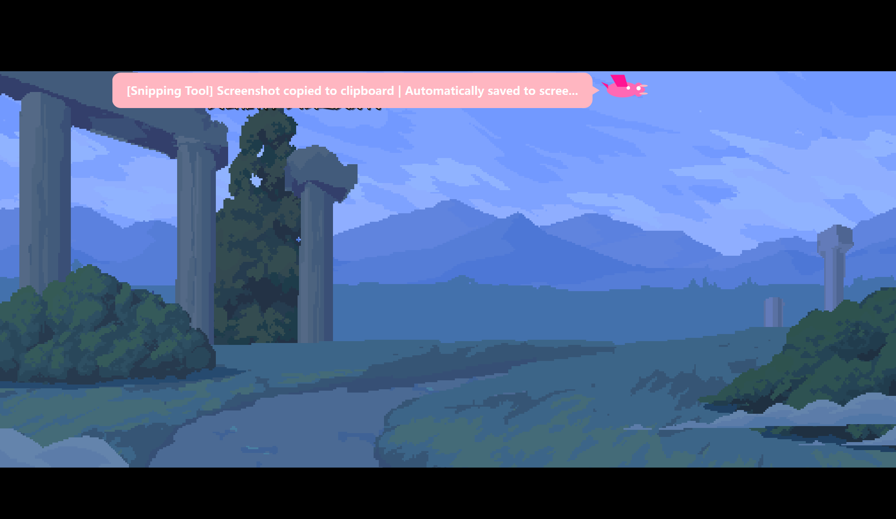
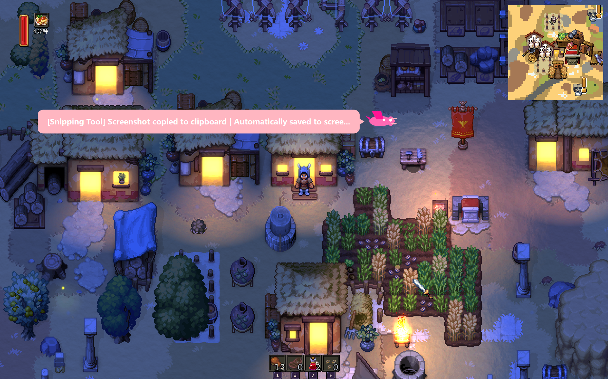
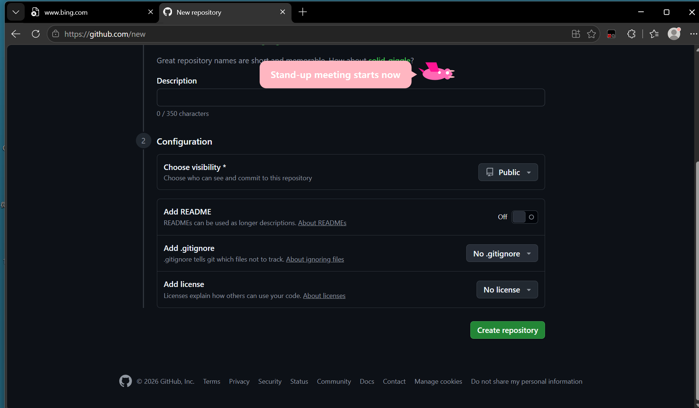
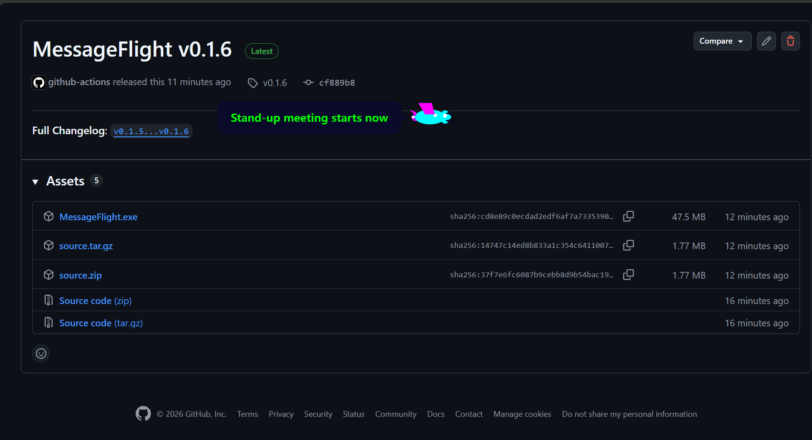

# MessageFlight

[中文](README.zh.md) | [English](README.md) | [日本語](README.ja.md) | [한국어](README.ko.md) | [Bahasa Indonesia](README.id.md) | [ไทย](README.th.md) | Tiếng Việt | [Bahasa Melayu](README.ms.md)

<p align="center">
  
  
  
  <a href="https://pypi.org/project/messageflight/"></a>
  <a href="LICENSE"></a>
  <a href="https://github.com/wx528/MessageFlight/actions/workflows/ci.yml"></a>
  <br>
  
</p>

Đưa thông báo Windows bay qua màn hình như một chiếc máy bay nhỏ.

## Ảnh chụp màn hình

| | | |
|:---:|:---:|:---:|
|  |  |  |
|  | | |

## Tính năng

- Hiển thị thông báo Windows thật bằng hoạt ảnh máy bay
- Menu khay hệ thống để tạm dừng, gửi demo, không làm phiền, cài đặt, tự khởi động và thoát
- UI đa ngôn ngữ nhẹ: zh, en, ja, ko, id, th, vi và ms
- Tùy chỉnh màu sắc, đường bay và preset phương tiện
- Hỗ trợ TTS tùy chọn qua SAPI hoặc MiniMax

## Bắt đầu nhanh

Yêu cầu Windows 10/11 và Python 3.11+.

```bash
git clone https://github.com/wx528/MessageFlight.git
cd MessageFlight
python -m venv .venv
.venv\Scripts\activate
pip install .
python message_flight.py
```

Dùng `uv`:

```bash
uv sync
uv run python message_flight.py
```

[MIT License](LICENSE)
